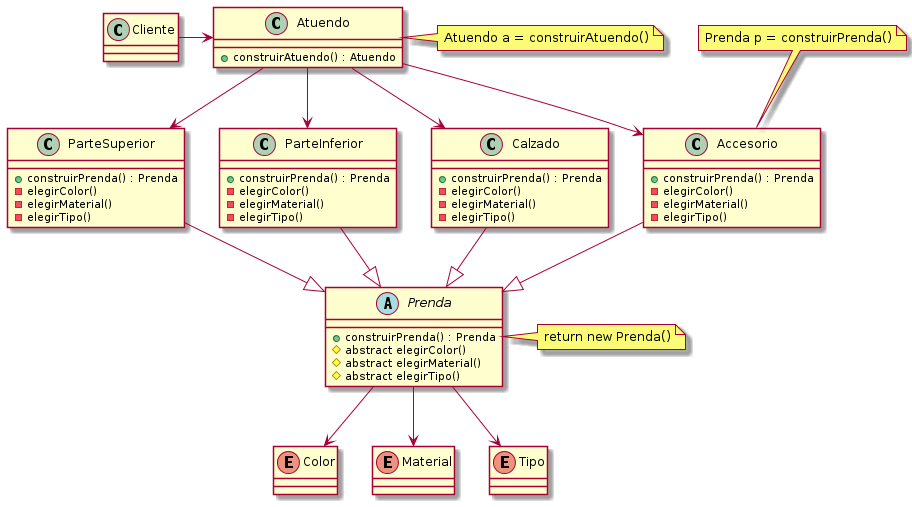
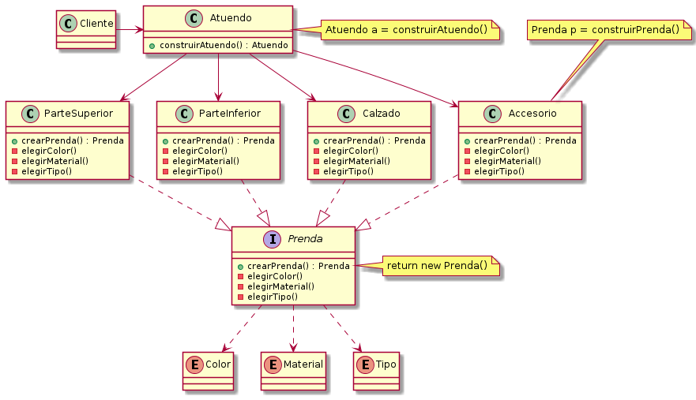
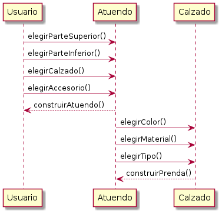

# Diagrama de clases (1)




# Diagrama de clases (2)



# Diagrama de secuencia



# Pseudocódigo

### Atuendo
Como un atuendo es una combinación de prendas que se tienen que usar juntas,
y como existen 4 categorías que engloban a las prendas. Entonces procedemos con
una clase que contiene acciones para elegir cada una de las categorías.

```
  class Atuendo{
          +construirAtuendo() : Atuendo
  }
```

- - -

### Categorías de prendas
Cada categoría de prenda requiere que se elija un color(primario ó secundario), 
su material (cuero, tela, ...) y el tipo (pantalón, remera corta, ....)
Estas tareas se las delegamos a la prenda, y las reutilizaremos en construirPrenda() 

```
  class Accesorio{
          +construirPrenda() : Prenda
          -elegirColor()
          -elegirMaterial()
          -elegirTipo()
  }
  class Calzado{
          +construirPrenda() : Prenda
          -elegirColor()
          -elegirMaterial()
          -elegirTipo()
  }
  class ParteSuperior{
          +construirPrenda() : Prenda
          -elegirColor()
          -elegirMaterial()
          -elegirTipo()
  }
  class ParteInferior{
          +construirPrenda() : Prenda
          -elegirColor()
          -elegirMaterial()
          -elegirTipo()
  }
```

- - -

### Prendas

En este tramo final cada prenda puede elegir el color, material y tipo
de un tipo enum donde podremos agregar las distintas variantes

```
  abstract class Prenda{
          +construirPrenda() : Prenda
          #abstract elegirColor()
          #abstract elegirMaterial()
          #abstract elegirTipo()
  }
  
  enum Color
  enum Material
  enum Tipo
```
